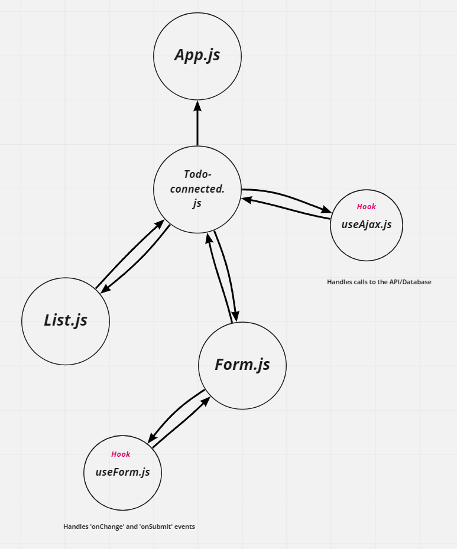

# Hooks API

To Do List Manager Phase 1: Begin the build of an application designed for creating and organizing a “To Do” list in your browser.

To Do List Manager Phase 2: Connecting the To Do Application to an external API and Database

## Overview

Today, we begin the first of a 4-phase build of the To Do List Manager, a web-based task manager application, written in React. In this first phase, our goal is to setup a foundational system using React hooks that we can build upon in later phases, adding databases, logins, and more advanced features.

In Phase 2, we’re going to connect the To Do Manager to a deployed API, backed by a database. The core functionality and stories do not change (reference Phase 1), but a new one has been added to note this shift in persistence.

## Author: William Moreno

## Collaborators

- James Gerstenberger

## Getting Started

The Hooks API can be found here on Netlify:

[Hooks API](https://zen-khorana-6553d5.netlify.app/)

## Features

- Class Based Components converted to Functional Components
- Styling and layout performed with React Bootstrap Components
- Current functionality works unchanged
- State managed using `useState()`
- `useEffect()` used to change the title of the browser to show to dos remaining
- To do items pre-loaded using `useEffect()`
- Provided mock-up design matched 
- `react-bootstrap` components and theming used

- Styling altered to track to the new mock-up
- React Bootstrap Components utilized for *almost* all styling
- `useForm` custom hook created and used to replace change/submit handlers in the form
- `useAjax` custom hook created and used to make calls to the API server using `axios`

## Process

Repository created. Create-react-app used to create project folder. Folder loaded into repository. Starter code copied into files of repository. Refactored todo.js first, then form.js and finally list.js. All three files converted to use hooks and use functions to replace classes. Code written to extend features to delete items from list. Bootstrap installed and bootstrap components used to style parts of all three files.

Replaced `Todo.js` with `Todo-connected.js`. Refactored `Todo-connected.js` to use `axios` in place of `fetch`. Once base functionality was achieved, created a delete item function utilizing `axios` and verified its functionality. Created `useForm.js` custom hook and connected it to `Form.js`. Created `useAjax.js` custom hook and connected it to `Todo-connected.js`. Styled page, form and list to better align with today's mockup. Debugged an issue where deleting or marking a task complete broke the app, eventually determined to be caused by to event listeners overlapping in the list.

App deployed on Netlify.

## UML

UML drawing created with [miro](https://miro.com/)

